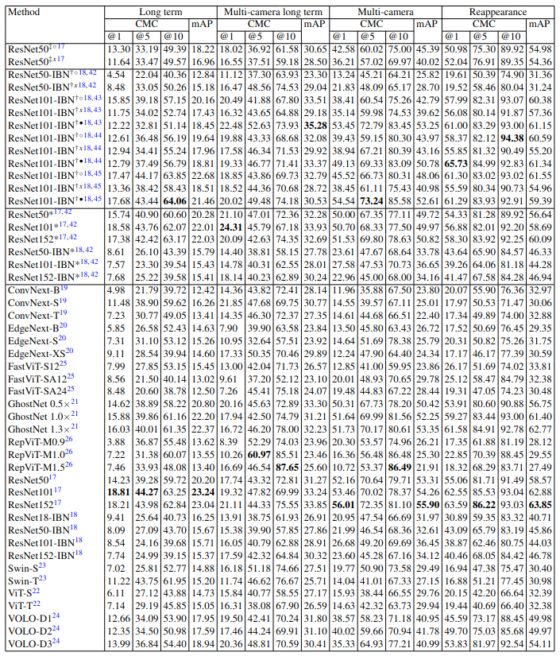

# 📈  Re-ID Benchmark Guide

Workflow summary:

1. **Create embeddings** for gallery and query sets, and store them in [HDF5 format](#hdf5-format) with the following folder convention:

   ```
   embeddings/{method_name}/{model_name}/{scenario}_{split}_embeddings.h5
   ```

2. **Run evaluation** with the provided scripts.  
   See [Run Evaluation](#run-evaluation) for examples.


## 📊 Evaluation Metrics

Evaluation is performed per subset pair, where each query split `test_k` is matched against the corresponding gallery split `train_k`.  
Final results are reported as the average across all such pairs.

The benchmark uses standard person Re-ID metrics:

| Metric  | Description |
|---------|-------------|
| **CMC@k** | Rank-k retrieval accuracy (probability that the correct ID is within the top-k results) |
| **mAP**   | Mean Average Precision across all queries, measuring overall retrieval quality |


## 🧩 HDF5 Format

Embeddings must be stored as HDF5 files with the following structure:

- `embeddings`: float32 array of shape `[N, D]` (features)  
- `ids`: int32 array of shape `[N]` (person IDs; negatives allowed for distractors)  
- `paths`: UTF-8 string array of length `N` (original image paths)

**Notes:**
- Paths are hierarchical, e.g.:  
  ```
  .../reid/<scenario>/<split>/<subset>/seq_xxx/imgs/<camera>/<id>/frame_xxx.png
  ```
- Subset parsing uses `/train/train_k/` and `/test/test_k/` in paths.
- Negative IDs (e.g., `-1`, `-4`) in queries represent **unknown identities**.


## Data Split Roles

Each ReID scenario provides multiple CSV files corresponding to different roles:

| CSV suffix     | Subset       | Purpose                          | Use during development? | Use in final report? |
|----------------|-------------|----------------------------------|--------------------------|----------------------|
| `_train`       | `train_0`   | Small training subset             | ✅ Fine-tuning     | ❌ |
| `_val`         | `test_0`    | Validation subset                 | ✅ Model selection, hyperparameter tuning | ❌ |
| `_gallery`     | train – `train_0` removed | Main gallery for evaluation | ⚠️ Only for feature extraction | ✅  |
| `_query`       | test – `test_0` removed   | Main queries for evaluation | ❌ | ✅ |

**Protocol:**  
- Use `_train` + `_val` **only for development** (fine-tuning, ablations, hyperparameter search).  
- Report final results using `_gallery` (as gallery) vs `_query` (as queries).  
- ⚠️ Do **not** tune on `_query`, as it is reserved for final evaluation only.


## Create Embeddings

We provide scripts to generate embeddings from the gallery and query CSV files using existing ReID frameworks such as [CION_ReIDZoo](https://github.com/Zplusdragon/CION_ReIDZoo), [FastReID](https://github.com/JDAI-CV/fast-reid), and [Centroids-ReID](https://github.com/bdager/centroids-reid).  

To run the embedding extraction, make sure to:
- Clone the corresponding repositories.  
- Download the required pre-trained model weights and configuration files from each repository.  


Use `create_embeddings.py` for one CSV or `get_embeddings_*.py` scripts for batches.

Example (single CSV):
```
python create_embeddings.py \
  --csv metadata/reid_multi_camera_gallery.csv \
  --input ../data/CHIRLA/benchmark \
  --output embeddings/fastreid \
  --config configs/Market1501/bagtricks_R101-ibn.yml \
  --cktp checkpoints/market_bot_R101-ibn.pth
```


## Run Evaluation

We provide flexible evaluation scripts supporting different evaluation modes.

#### Per-Subset Evaluation
Report averaged metrics over all `train_k` / `test_k` subset pairs of specific gallery and query files:

```bash
python evaluate_reid.py     --gallery embeddings/gallery_embeddings.h5     --query embeddings/query_embeddings.h5     --topk 1 5 10     --per-subset
```

#### Single Subset Evaluation
To test a specific subset pair (`train_k` vs `test_k`):

```bash
python evaluate_reid.py     --gallery embeddings/gallery_train_k.h5     --query embeddings/query_test_k.h5     --topk 1 5 10
```

#### Batch Evaluation
Run evaluation across scenarios for a specific Re-ID model embedding:

```bash
python run_all_evaluations.py     --base-dir fastreid     --output evaluation_results.csv
```

Arguments:  
- `--base-dir`: Base directory containing HDF5 files (e.g., `fastreid`, `CION/` or any model you use to extract the embeddings)  
- `--output`: Output CSV file for results (default: `evaluation_results.csv`)  

By default, batch evaluation averages metrics across subsets.

<!-- ### 11. Code Reference
| Script | Purpose |
|--------|---------|
| `create_embeddings.py` | Single CSV embedding extraction |
| `get_embeddings_fastreid.py` / `get_embeddings_centroids.py` / `get_embeddings_cion.py` | Batch extraction per method |
| `evaluate_reid.py` | Core metric computation (CMC, mAP, optional per-subset) |
| `run_all_evaluations.py` | Batch evaluate all generated embeddings |
| `inference_*.py` | Convenience inference on single image or set | -->


## 📌 Open / Closed Set Evaluation 

We report **closed-set evaluation** for baseline results, excluding distractors (unknown IDs) from the test/query set.  

Since CHIRLA also provides distractors in the test set, it naturally supports **open-set evaluation**, where models must distinguish between known and unknown IDs by applying a similarity threshold. This setting better reflects real-world deployment conditions, and we encourage the community to explore it.

To approximate **open-set mAP**, add a threshold argument when running the evaluation scripts (`evaluate_reid.py` or `run_all_evaluations.py`):

```
--open-map-threshold <value>
```

For detailed results and experimental settings, please refer to our [paper](https://arxiv.org/pdf/2502.06681).





## 🙏 Acknowledgements

We thank the great works and open-source repositories: [CION_ReIDZoo](https://github.com/Zplusdragon/CION_ReIDZoo), [FastReID](https://github.com/JDAI-CV/fast-reid) and [Centroids-ReID](https://github.com/mikwieczorek/centroids-reid).