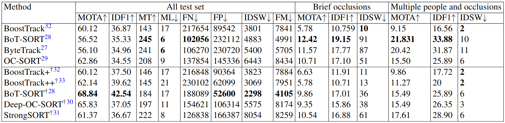

# 📈 Tracking Benchmark Guide

This repository contains scripts to:
- Prepare CHIRLA ground truth (GT) in MOT format
- Run trackers over videos
- Save results in TrackEval layout
- Evaluate with TrackEval

## 📂 Directory Layout
- `data/` – MOT-style GT and tracker outputs created by these scripts
- `TrackEval/` – Evaluation toolkit ([TrackEval](https://github.com/bdager/TrackEval))
- Scripts:
  - `benchmark_to_MOT.py` – Convert CHIRLA JSON annotations to MOT GT with seqmaps
  - `annotations_to_MOT.py` – Convert raw annotations to CHIRLA_all MOT GT (seqinfo + seqmaps)
  - `tracker_botmox_all_videos.py` – Run YOLO + boxmot trackers over all videos to generate results
  - `generate_subset_trackers.py` – Build brief/multi trackers from CHIRLA_all results


## 📊 Evaluation Metrics
We use **CLEAR** and **Identity** metrics (MOTA, IDF1, etc.), evaluated with [TrackEval](https://github.com/bdager/TrackEval) and using MOT-style result format (10 columns):
```
frame,id,x,y,w,h,conf,-1,-1,-1
```


## 1) Prepare Ground Truth in MOT format
Create MOT-style GT for **CHIRLA_all** (all annotations from CHIRLA dataset) and seqmaps:

```bash
python benchmark/tracking/annotations_to_MOT.py \
	--input_dir data/CHIRLA/annotations \
	--output_dir benchmark/tracking_MOT \
	--verbose
```

Create scenario-specific GT (brief and multiple-people-occlusion) with seqmaps:

```bash
python benchmark/tracking/benchmark_to_MOT.py \
	--input_dir data/CHIRLA/benchmark/tracking \
	--output_dir benchmark/tracking_MOT \
	--scenario all --split all --verbose
```

Outputs:
- `benchmark/tracking_MOT/CHIRLA_all-{train,test}/<seq_cam_time>/gt/gt.txt`
- `benchmark/tracking_MOT/CHIRLA_{scenario}-{train,test}/<seq_cam_time>/gt/gt.txt`
- `benchmark/tracking_MOT/seqmaps/CHIRLA_*-{train,test}.txt`

## 2) Run tracking over videos (write MOT results)
We provide scripts to run trackers via [boxmot](https://github.com/mikel-brostrom/boxmot) with YOLO as detector:  

Supported trackers: [BoostTrack](https://github.com/vukasin-stanojevic/BoostTrack?utm_source=chatgpt.com), [BoostTrack+](https://github.com/vukasin-stanojevic/BoostTrack), [BoostTrack++](https://github.com/vukasin-stanojevic/BoostTrack?utm_source=chatgpt.com), [BoT-SORT](https://github.com/NirAharon/BoT-SORT), [ByteTrack](https://github.com/FoundationVision/ByteTrack), [OC-SORT](https://github.com/noahcao/OC_SORT), [Deep-OC-SORT](https://github.com/GerardMaggiolino/Deep-OC-SORT), [StrongSORT](https://github.com/dyhBUPT/StrongSORT).

### Batch Process All Videos
```
python benchmark/tracking/tracker_botmox_all_videos.py \
	--videos-root data/CHIRLA/videos \
	--output-root benchmark/tracking/results \
	--mot-root benchmark/tracking/data/trackers \
	--benchmark CHIRLA_all --split test \
	--model benchmark/tracking/models/yolo11n.pt \
	--tracker bytetrack --conf 0.25 --device 0
```
Supported trackers: boosttrack, boosttrack+, boosttrack++, strongsort, ocsort, deepocsort, bytetrack, botsort.

### Appearance-based Trackers
For trackers with ReID support ([BoostTrack+](https://github.com/vukasin-stanojevic/BoostTrack), [BoostTrack++](https://github.com/vukasin-stanojevic/BoostTrack?utm_source=chatgpt.com), [BoT-SORT](https://github.com/NirAharon/BoT-SORT),  [Deep-OC-SORT](https://github.com/GerardMaggiolino/Deep-OC-SORT), [StrongSORT](https://github.com/dyhBUPT/StrongSORT)), enable `--with-reid` and specify weights:

```bash
python benchmark/tracking/tracker_botmox_all_videos.py \
	--videos-root data/CHIRLA/videos \
	--mot-root benchmark/tracking/data/trackers \
	--benchmark CHIRLA_all --split test \
	--tracker botsort --with-reid \
	--reid-weights benchmark/tracking/models/osnet_x0_25_msmt17.pt
```

**Creates:** `<mot_root>/CHIRLA_all-{train,test}/<Tracker>/data/<seq_camera_time>.txt`

> If you run your own tracker, ensure outputs follow the same MOT layout and directory structure.

<!-- ### 3) Restructure tracker outputs (optional)
If you have per-camera files under scenario folders, convert them to TrackEval’s expected layout:
```
python benchmark/tracking/restructure_trackers_to_MOT.py \
	--input_dir benchmark/tracking/data/trackers \
	--output_dir benchmark/tracking/data/trackers_mot \
	--scenario all --include_train_test_split --train_seqs seq_004,seq_026
```
Creates: `<output>/<CHIRLA_brief|CHIRLA_multi>-{train,test}/<Tracker>/data/<seq_camera>.txt`.

<output_root>/CHIRLA_brief-train/<Tracker>/data/seq_004_camera_1_xxx.txt -->

## 4) Generate Subset Tracker Results
After producing CHIRLA_all tracker results, you can build **brief/multi** tracker files by sampling CHIRLA_all outputs using per-frame IoU best-match:

```bash
python benchmark/tracking/generate_subset_trackers.py \
	--source_benchmark CHIRLA_all \
	--target_benchmarks CHIRLA_brief CHIRLA_multi \
	--splits test \
	--trackers bytetrack botsort \
	--gt_root benchmark/tracking/data/gt \
	--tracker_root benchmark/tracking/data/trackers \
```

### 5) Evaluate with TrackEval
Run [TrackEval](https://github.com/bdager/TrackEval):
```
python benchmark/tracking/TrackEval/scripts/run_chirla_challenge.py \
--GT_FOLDER benchmark/tracking/data/gt \
--TRACKERS_FOLDER benchmark/tracking/data/trackers \
--BENCHMARK CHIRLA_brief \
--SPLIT_TO_EVAL test \ 
--TRACKERS_TO_EVAL BoostTrack++ BoT-SORT-reid \
--METRICS CLEAR Identity
```

Notes:
- Ensure `seqmaps/CHIRLA_all-{train,test}.txt` exist (created by step 1).
- Tracker outputs must be placed under:  
  `<TRACKERS_FOLDER>/CHIRLA_{scenario/all}-{split}/<TrackerName>/data/<sequence>.txt`  
  with 10 MOT columns.


### 📌 Baselines
For baseline results and configurations, see our [paper](https://arxiv.org/pdf/2502.06681).  



## 🙏 Acknowledgements
We thank the open-source community and tools that made this benchmark possible:   [boxmot](https://github.com/mikel-brostrom/boxmot), [BoostTrack](https://github.com/vukasin-stanojevic/BoostTrack?utm_source=chatgpt.com),  [BoT-SORT](https://github.com/NirAharon/BoT-SORT), [ByteTrack](https://github.com/FoundationVision/ByteTrack), [OC-SORT](https://github.com/noahcao/OC_SORT), [Deep-OC-SORT](https://github.com/GerardMaggiolino/Deep-OC-SORT), [StrongSORT](https://github.com/dyhBUPT/StrongSORT), [TrackEval](https://github.com/JonathonLuiten/TrackEval).